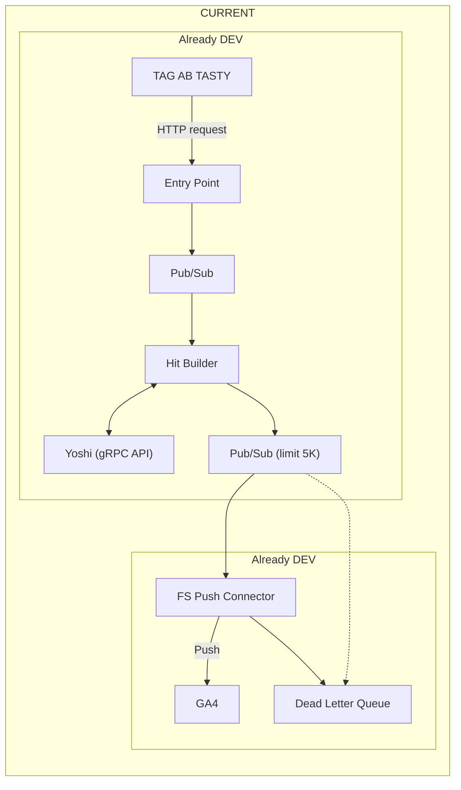

# GA4 Server – AB Tasty S2S Integration

This document describes the server-to-server (S2S) integration that forwards AB Tasty events to Google Analytics 4 (GA4). It targets engineers who operate or maintain the event delivery pipeline.

---

## Architecture Diagram



---

## High-Level Flow

1. The AB Tasty Web SDK sends batched events to the Ariane endpoint.  
2. The Entry Point service validates and normalises the batch.  
3. The service publishes each event to Pub/Sub.  
4. The Hit Builder subscribes, enriches events, and calls **Yoshi** via gRPC for rules or metadata.  
5. The Hit Builder publishes processed messages to the delivery Pub/Sub topic, ensuring a 5 KB message size limit.  
6. The FS Push Connector pulls from that topic and sends GA4 hits through the Measurement Protocol.  
7. Failed pushes are redirected to a Dead Letter Queue (DLQ) for later reprocessing.  

---

## Why Server-to-Server

- Eliminates client-side blockers such as ad blockers.  
- Ensures consistent tagging and event mapping.  
- Supports retries and exponential backoff on failures.  
- Keeps the GA4 API secret secure and out of the browser.  

---

## How to Configure GA4 Measurement Protocol

> **Feature status:** Early Access (EA).  
> If you wish to enable this feature, please contact your CSM.

Google Analytics 4 Measurement Protocol allows you to send event data directly from the server instead of relying only on the client-side tag. This ensures more reliable tracking, even when ad blockers or network restrictions prevent client-side events from firing.

By adding your API secret in the AB Tasty GA4 connector, you can activate server-to-server (S2S) data push.

Learn more about [Measurement Protocol in GA4](https://developers.google.com/analytics/devguides/collection/protocol/ga4).

### Configuration Steps

#### 1. Find Your API Secret

To retrieve your GA4 API secret:

1. In Google Analytics, go to **Admin → Property → Data Streams**.  
2. Select your data stream.  
3. Under **Measurement Protocol API secrets**, click **Create**.  
4. Name your secret, then copy the generated API secret.

#### 2. Add the API Secret in AB Tasty

To create or edit a connector, refer to the general GA4 integration article.

1. Go to **Integrations → Integration Hub**.  
2. Create or edit your **Google Analytics 4 Push** connector.  
3. Paste your API secret into the **Measurement Protocol** field.  
4. Save your configuration.

Below is an example of how this looks in the AB Tasty settings interface:


Once enabled, AB Tasty sends campaign events to GA4 both from the client-side session and the server, ensuring better reliability and data consistency.

### Benefits of Using Measurement Protocol

- **Data resilience:** Uses the same event data for AB Tasty and GA4, ensuring consistent tracking.  
- **Improved accuracy:** Reduces discrepancies caused by ad blockers or script failures.  
- **Full coverage:** Complements client-side tracking with robust server-side delivery.

### Troubleshooting

If data doesn’t appear in GA4:

- Verify that your API secret is valid and active.  
- Confirm that the campaign is live (events only send for active campaigns).  

---

## Components

### Entry Point
- Receives AB Tasty event batches from the browser.  
- Performs schema validation and authentication.  
- Builds a standard envelope and writes to `pubsub.ingest`.  

### Pub/Sub
- Provides durable queuing between services.  
- Topics: `ingest`, `builder.out`, `dlq`.  

### Hit Builder
- Subscribes to `ingest`.  
- Enriches events with experiment context and user identity.  
- Communicates with **Yoshi** via gRPC to fetch campaign and variation metadata.  
- Validates message size, splitting or truncating near 5 KB.  
- Publishes to `builder.out`.  

### Yoshi (gRPC API)
- Exposes AB Tasty campaign and variation metadata.  
- Used by the Hit Builder for resolving IDs to names.  

### FS Push Connector
- Subscribes to `builder.out`.  
- Converts messages to GA4 Measurement Protocol v2 format.  
- Pushes events to GA4.  
- On non-2xx responses, writes the event to `dlq` with error details.  

### Dead Letter Queue (DLQ)
- Stores failed events for review or replay.  
- Replay jobs can requeue fixed messages for reprocessing.  

---

## Incoming Payload Example

AB Tasty sends batches as plain text JSON (`content-type: text/plain; charset=UTF-8`):

```json
{
  "c": { "1446694": "1798770", "1528682": "0" },
  "cid": "1ceff369b6cd9aceaa9ee318e6498167",
  "vid": "50j4xej08thkh2fc",
  "dl": "https%3A%2F%2Fval-nextjs-abtasty.vercel.app%2Fproducts%2F4",
  "tsv": "4.23.0",
  "h": [
    { "qt": 523, "t": "PAGEVIEW" },
    { "caid": "1446694", "vaid": "1798770", "qt": 503, "t": "CAMPAIGN" },
    {
      "caid": "1528682",
      "vaid": "0",
      "qt": 502,
      "t": "CAMPAIGN",
      "ga4": {
        "iids": ["11151"],
        "cid": "634188769.1761913011",
        "sid": "1761924527",
        "tsS": 1761925404752000,
        "pl": "https://val-nextjs-abtasty.vercel.app/products/4",
        "pt": "Unknown Title"
      }
    }
  ],
  "t": "BATCH"
}
```

**Notes**  
- `c` maps campaign IDs to variation IDs.  
- `vid` is the AB Tasty visitor ID.  
- `h` contains individual events to be mapped to GA4 events.  

---

## Mapping to GA4 Measurement Protocol

Each event results in an HTTP POST to:

```
https://www.google-analytics.com/mp/collect?measurement_id=<MEASUREMENT_ID>&api_secret=<API_SECRET>
```

Example payload:

```json
{
  "client_id": "50j4xej08thkh2fc",
  "user_id": "1ceff369b6cd9aceaa9ee318e6498167",
  "timestamp_micros": 1761925404752000,
  "non_personalized_ads": false,
  "events": [
    {
      "name": "ab_page_view",
      "params": {
        "page_location": "https://val-nextjs-abtasty.vercel.app/products/4",
        "engagement_time_msec": 523,
        "ab_caid": "1528682",
        "ab_vaid": "0",
        "experiment_ids": "11151",
        "debug_mode": false
      }
    }
  ]
}
```

**Recommendations**
- Prefix AB Tasty attributes with `ab_`.  
- Use GA4 standard parameters (`page_location`, `session_id`) where applicable.  
- Set `debug_mode` to true when sending to the debug endpoint.  

---

## Identity and Sessions

- Prefer `user_id` when a stable user identifier is available.  
- Fallback to `client_id` derived from the AB Tasty visitor ID if necessary.  
- Map AB Tasty session data to GA4’s `session_id` when available.  

---

## Error Handling and Retries

- The connector retries on `429` and `5xx` responses with exponential backoff.  
- On `400` or `403`, it writes the failed event to the DLQ along with the response body.  
- A replay tool can read from DLQ and requeue events after configuration fixes.  

---

## Observability

- Log structured entries with `event_id`, `caid`, `vaid`, and `status`.  
- Collect metrics: ingestion rate, builder latency, push success rate, DLQ depth.  
- Expose health endpoints for all services.  

---

## Configuration

| Key | Example | Purpose |
| --- | --- | --- |
| `GA4_MEASUREMENT_ID` | G-XXXXXXX | GA4 target property |
| `GA4_API_SECRET` | secret | Measurement Protocol authentication |
| `PUSH_TIMEOUT_MS` | 5000 | GA4 HTTP timeout |
| `PUBSUB_TOPIC_INGEST` | ingest | Input topic |
| `PUBSUB_TOPIC_OUT` | builder.out | Output topic |
| `PUBSUB_TOPIC_DLQ` | dlq | Dead letters |
| `YOSHI_ADDR` | yoshi:50051 | gRPC endpoint |
| `MAX_MSG_SIZE_BYTES` | 5000 | Message size limit |

---

## Local Testing

Use `curl` to send a sample batch to the entry point and validate connector behaviour:

```bash
curl -X POST "http://localhost:8080/ingest"   -H "content-type: text/plain; charset=UTF-8"   --data-binary @sample-batch.json
```

When testing, point the connector to the GA4 debug endpoint.  

---

## Security

- Keep the GA4 API secret server-side only.  
- Require authentication tokens on the entry point.  
- Enforce payload size and schema validation.  

---

## Glossary

- **Ariane** – AB Tasty collection endpoint for browser batches.  
- **Hit Builder** – Service that transforms AB Tasty events for GA4.  
- **Yoshi** – gRPC metadata service for campaign and variation lookups.  
- **FS Push Connector** – Worker that pushes GA4 events.  
- **DLQ** – Dead Letter Queue for failed messages.  

---

## Changelog

- **2025-10-31** – Initial draft with GA4 Measurement Protocol configuration and AB Tasty settings illustration.
