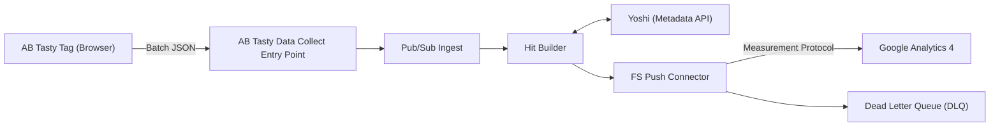

# GA4 Server – AB Tasty S2S Integration

This document describes the server-to-server (S2S) integration that forwards AB Tasty events to Google Analytics 4 (GA4).

## Architecture Diagram



## Unifying AB Tasty and GA4 Data to Eliminate Discrepancies

The **AB Tasty x GA4 Server-to-Server Integration** ensures that both platforms capture identical, validated data directly from the backend. This unified approach removes inconsistencies caused by browser conditions, consent differences, or timing mismatches, delivering cleaner, more reliable analytics.

### Key Benefits

- **Eliminates client-side blockers such as ad blockers**  
  Events are transmitted server-side, preventing data loss from browser extensions, tracking prevention, or unstable network conditions.  

- **Ensures consistent tagging and event mapping**  
  Both AB Tasty and GA4 process the same enriched payload, keeping campaign, event, and variation identifiers perfectly aligned.  

- **Aligns data consent across platforms**  
  Consent is handled once at the server level, ensuring both systems apply identical privacy and data collection rules.  

- **Maintains session and user consistency**  
  Shared session and visitor identifiers synchronise session-based and user-based metrics, minimising reporting gaps.  

- **Delivers accurate timing and sequencing**  
  Server-side timestamps guarantee precise event order, unaffected by device clock drift or delayed client events.  

- **Guarantees data completeness through retries**  
  Automatic retries and exponential backoff ensure reliable event delivery, even during temporary API or network issues.  

## High-Level Flow

1. The AB Tasty Web pixel sends batched events to the AB Tasty Data Collect.  
2. The Entry Point service validates and normalises the batch.  
3. The service publishes each event to Pub/Sub.  
4. The Hit Builder subscribes, enriches events, and calls **Yoshi** via gRPC for rules or metadata.  
5. The Hit Builder publishes processed messages to the delivery Pub/Sub topic, ensuring a 5 KB message size limit.  
6. The FS Push Connector pulls from that topic and sends GA4 hits through the Measurement Protocol.  
7. Failed pushes are redirected to a Dead Letter Queue (DLQ) for later reprocessing.  


## How to Configure GA4 Measurement Protocol

> **Feature status:** Early Access (EA).  
> If you wish to enable this feature, please contact your CSM.

Google Analytics 4 Measurement Protocol allows you to send event data directly from the server instead of relying only on the client-side tag. This ensures more reliable tracking, even when ad blockers or network restrictions prevent client-side events from firing.

By adding your API secret in the AB Tasty GA4 connector, you can activate server-to-server (S2S) data push.

Learn more about [Measurement Protocol in GA4](https://developers.google.com/analytics/devguides/collection/protocol/ga4).

### Configuration Steps

#### 1. Find Your API Secret

To retrieve your GA4 API secret:

1. In Google Analytics, go to **Admin → Property → Data Streams**.  
2. Select your data stream.  
3. Under **Measurement Protocol API secrets**, click **Create**.  
4. Name your secret, then copy the generated API secret.

#### 2. Add the API Secret in AB Tasty

To create or edit a connector, refer to the general GA4 integration article.

1. Go to **Integrations → Integration Hub**.  
2. Create or edit your **Google Analytics 4 Push** connector.  
3. Paste your API secret into the **Measurement Protocol** field.  
4. Save your configuration.

Below is an example of how this looks in the AB Tasty settings interface:


Once enabled, AB Tasty sends campaign events to GA4 both from the client-side session and the server, ensuring better reliability and data consistency.

## Benefits of Using Measurement Protocol

- **Data resilience:** Uses the same event data for AB Tasty and GA4, ensuring consistent tracking.  
- **Improved accuracy:** Reduces discrepancies caused by ad blockers or script failures.  
- **Full coverage:** Complements client-side tracking with robust server-side delivery.

## Incoming Payload Example

AB Tasty sends batches as plain text JSON (`content-type: text/plain; charset=UTF-8`):

```json
{
  "c": { "1446694": "1798770", "1528682": "0" },
  "cid": "1ceff369b6cd9aceaa9ee318e6498167",
  "vid": "50j4xej08thkh2fc",
  "dl": "https%3A%2F%2Fval-nextjs-abtasty.vercel.app%2Fproducts%2F4",
  "tsv": "4.23.0",
  "h": [
    { "qt": 523, "t": "PAGEVIEW" },
    { "caid": "1446694", "vaid": "1798770", "qt": 503, "t": "CAMPAIGN" },
    {
      "caid": "1528682",
      "vaid": "0",
      "qt": 502,
      "t": "CAMPAIGN",
      "ga4": {
        "iids": ["11151"],
        "cid": "634188769.1761913011",
        "sid": "1761924527",
        "tsS": 1761925404752000,
        "pl": "https://val-nextjs-abtasty.vercel.app/products/4",
        "pt": "Unknown Title"
      }
    }
  ],
  "t": "BATCH"
}
```

**Notes**  
- `c` maps campaign IDs to variation IDs.  
- `vid` is the AB Tasty visitor ID.  
- `h` contains individual events to be mapped to GA4 events.  

## Where to Find GA4 Data in the Ariane Payload

The GA4 data is directly visible in the browser’s Network panel when inspecting Ariane requests. You can confirm that GA4 information is correctly embedded before it ever reaches the backend.

### How to Inspect

1. Open DevTools Network tab.  
2. Filter for requests to `https://ariane.abtasty.com/`.  
3. Select a request and open **Request Payload**.  
4. Find the event in `h` that includes the `ga4` object.

### Example `curl` Request

```bash
curl 'https://ariane.abtasty.com/'   -H 'accept: */*'   -H 'content-type: text/plain;charset=UTF-8'   -H 'origin: https://val-nextjs-abtasty.vercel.app'   -H 'referer: https://val-nextjs-abtasty.vercel.app/'   --data-raw '{"c":{"1446694":"1798770","1528682":"0"},"cid":"1ceff369b6cd9aceaa9ee318e6498167","vid":"50j4xej08thkh2fc","dr":"","pt":"","de":"UTF-8","dl":"https%3A%2F%2Fval-nextjs-abtasty.vercel.app%2Fproducts%2F4","cst":1761924519338,"sn":3,"lv":"NgyzkXQL","tsv":"4.23.0","tv":"latest","tch":"1bf6d","h":[{"qt":523,"t":"PAGEVIEW"},{"caid":"1446694","vaid":"1798770","qt":503,"t":"CAMPAIGN"},{"caid":"1528682","vaid":"0","qt":502,"t":"CAMPAIGN","ga4":{"iids":["11151"],"cid":"634188769.1761913011","sid":"1761924527","tsS":1761925404752000,"pl":"https://val-nextjs-abtasty.vercel.app/products/4","pt":"Unknown Title"}}],"t":"BATCH"}'
```

## Detailed Explanation of GA4 Fields

| **Field** | **Description** | **GA4 Equivalent** | **Purpose** |
|------------|----------------|--------------------|--------------|
| `ga4.cid` | Client ID | `client_id` | Identifies a unique user instance of the app or site. |
| `ga4.sid` | Session ID | `ga_session_id` | A unique numeric identifier for the user’s current session. |
| `ga4.tsS` | Session start timestamp (in microseconds) | Used for `session_start` event timing | Records the exact time the session began. |
| `ga4.iids` | Integration IDs | Custom event parameters | Links AB Tasty experiments or features to GA4 events. |
| `ga4.pl` | Page location | `page_location` | The full URL of the page where the event occurred. |
| `ga4.pt` | Page title | `page_title` | The title of the web page where the event was triggered. |
| `vid` | AB Tasty Visitor ID | Optional user property | Identifies the user according to AB Tasty’s visitor logic. |

### Example Event Mapping

```json
{
  "caid": "1528682",
  "vaid": "0",
  "qt": 502,
  "t": "CAMPAIGN",
  "ga4": {
    "iids": ["11151"],
    "cid": "634188769.1761913011",
    "sid": "1761924527",
    "tsS": 1761925404752000,
    "pl": "https://val-nextjs-abtasty.vercel.app/products/4",
    "pt": "Unknown Title"
  }
}
```

Converted GA4 payload (simplified):

```json
{
  "client_id": "634188769.1761913011",
  "user_properties": {
    "abtasty_vid": { "value": "50j4xej08thkh2fc" }
  },
  "events": [
    {
      "name": "campaign",
      "params": {
        "ga_session_id": 1761924527,
        "page_location": "https://val-nextjs-abtasty.vercel.app/products/4",
        "page_title": "Unknown Title",
        "abtasty_integration_id": "11151"
      }
    }
  ]
}
```

## How GA4 Knows About AB Tasty Campaign IDs

GA4 learns about AB Tasty campaign IDs through enrichment and event mapping that occurs during the server-to-server integration flow, specifically in the Hit Builder and FS Push Connector stages.

1. **AB Tasty Tag Sends Campaign Data**  
   The AB Tasty Web SDK sends campaign and variation IDs (`caid`, `vaid`) in the Ariane payload.  

2. **Hit Builder Enrichment**  
   The Hit Builder enriches events by calling **Yoshi** to retrieve metadata and integration IDs (`iids`). These IDs map AB Tasty campaigns to GA4 parameters.  

3. **FS Push Connector Mapping**  
   The FS Push Connector converts the enriched data into GA4 Measurement Protocol format. Campaign metadata is included through custom parameters (like `abtasty_integration_id`).  

4. **GA4 Event Storage**  
   GA4 stores the received parameters and links them with user sessions. While GA4 never receives raw campaign IDs, it can identify the AB Tasty campaign through integration metadata.  

In short, GA4 knows which AB Tasty campaign triggered an event because AB Tasty’s backend maps internal campaign IDs to GA4 integration parameters during enrichment before sending them via the Measurement Protocol.

## Changelog

- **2025-10-31** – Added GA4 payload inspection section, detailed GA4 field explanations, and simplified architecture diagram.
