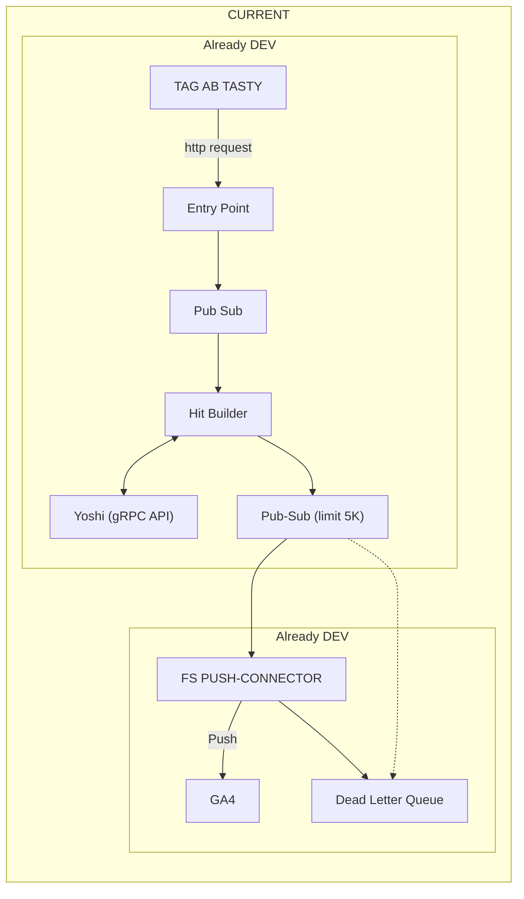

# GA4 Server - AB Tasty S2S Integration

This document explains a server to server integration that forwards AB Tasty events to Google Analytics 4. It targets engineers who run or maintain the pipeline.


## Diagram




## High level flow

1. The AB Tasty Web SDK sends batched events to the Ariane endpoint.
2. The entry point service validates and normalises the batch.
3. The service publishes each event to Pub/Sub.
4. The Hit Builder subscribes. It enriches the event, then calls Yoshi through gRPC for rules or metadata.
5. The Hit Builder posts a processed message to a delivery Pub/Sub topic. It respects a 5K size limit.
6. The FS Push Connector pulls from that topic and pushes GA4 hits to Measurement Protocol. 
7. Failed pushes are routed to a Dead Letter Queue for reprocessing.


## Why server to server

- Removes client side blockers such as ad blockers.
- Ensures consistent tagging and mapping.
- Allows retries and backoff on failures.
- Keeps the secret GA4 API key out of the browser.


## Components

### Entry Point
- Receives AB Tasty batches from the browser.
- Performs schema and auth checks.
- Builds a standard envelope and writes to `pubsub.ingest`.

### Pub/Sub
- Durable queue between services.
- Topics: `ingest`, `builder.out`, `dlq`.

### Hit Builder
- Subscribes to `ingest`.
- Enriches with experiment context and identity.
- Talks to **Yoshi** by gRPC to fetch campaign and variation data.
- Validates size - splits or truncates if close to 5 KB message size.
- Publishes to `builder.out`.

### Yoshi (gRPC API)
- Service that exposes AB Tasty metadata. 
- Required to resolve campaign and variation ids to names.

### FS Push Connector
- Reads `builder.out`.
- Converts to GA4 Measurement Protocol v2 format.
- Pushes to GA4.
- On non 2xx it publishes to `dlq` with error details.

### Dead Letter Queue
- Stores failed messages.
- Use a replay job to requeue after fix.


## Incoming payload - example

AB Tasty sends a JSON batch similar to this. The browser sets `content-type: text/plain; charset=UTF-8`.

```json
{
  "c": { "1446694": "1798770", "1528682": "0" },
  "cid": "1ceff369b6cd9aceaa9ee318e6498167",
  "vid": "50j4xej08thkh2fc",
  "dl": "https%3A%2F%2Fval-nextjs-abtasty.vercel.app%2Fproducts%2F4",
  "tsv": "4.23.0",
  "h": [
    { "qt": 523, "t": "PAGEVIEW" },
    { "caid": "1446694", "vaid": "1798770", "qt": 503, "t": "CAMPAIGN" },
    { "caid": "1528682", "vaid": "0", "qt": 502, "t": "CAMPAIGN",
      "ga4": {
        "iids": ["11151"],
        "cid": "634188769.1761913011",
        "sid": "1761924527",
        "tsS": 1761925404752000,
        "pl": "https://val-nextjs-abtasty.vercel.app/products/4",
        "pt": "Unknown Title"
      }
    }
  ],
  "t": "BATCH"
}
```

Notes
- `c` maps campaign id to variation id.
- `vid` is the AB Tasty visitor id.
- `h` contains events. The builder will map them to GA4 events.


## Mapping to GA4 Measurement Protocol

The Push Connector sends one HTTP POST per event to

```
https://www.google-analytics.com/mp/collect?measurement_id=<MEASUREMENT_ID>&api_secret=<API_SECRET>
```

Payload example

```json
{
  "client_id": "50j4xej08thkh2fc",
  "user_id": "1ceff369b6cd9aceaa9ee318e6498167",
  "timestamp_micros": 1761925404752000,
  "non_personalized_ads": false,
  "events": [
    {
      "name": "ab_page_view",
      "params": {
        "page_location": "https://val-nextjs-abtasty.vercel.app/products/4",
        "engagement_time_msec": 523,
        "ab_caid": "1528682",
        "ab_vaid": "0",
        "experiment_ids": "11151",
        "debug_mode": false
      }
    }
  ]
}
```

Recommended naming
- Keep raw AB Tasty values under `ab_*` params.
- Use GA4 standard params where possible such as `page_location` and `session_id`.
- Set `debug_mode` when sending to the debug endpoint during testing.


## Identity and sessions

- Prefer `user_id` if you have a stable id in your site. 
- Fall back to `client_id` derived from the AB Tasty visitor id if needed.
- Map AB Tasty session to GA4 `session_id` when present.


## Error handling and retries

- Connector retries on 429 and 5xx with exponential backoff.
- On 400 or 403 the message goes to DLQ with the response body.
- A replay tool reads DLQ and re-publishes after you fix config or mapping.


## Observability

- Log structured entries with `event_id`, `caid`, `vaid`, `status`.
- Add metrics: ingest rate, builder latency, push success rate, DLQ depth.
- Expose health endpoints for each service.


## Config - env vars

| Key | Example | Purpose |
| --- | --- | --- |
| `GA4_MEASUREMENT_ID` | G-XXXXXXX | Target property |
| `GA4_API_SECRET` | secret | Auth for MP |
| `PUSH_TIMEOUT_MS` | 5000 | GA4 HTTP timeout |
| `PUBSUB_TOPIC_INGEST` | ingest | Input topic |
| `PUBSUB_TOPIC_OUT` | builder.out | Output topic |
| `PUBSUB_TOPIC_DLQ` | dlq | Dead letters |
| `YOSHI_ADDR` | yoshi:50051 | gRPC target |
| `MAX_MSG_SIZE_BYTES` | 5000 | Safety limit |


## Local testing

- Use `curl` to hit the entry point with the example batch. 
- Point the connector at the GA4 debug endpoint for validation.

```bash
curl -X POST "http://localhost:8080/ingest" \
  -H "content-type: text/plain; charset=UTF-8" \
  --data-binary @sample-batch.json
```


## Security

- Do not expose the GA4 API secret to the browser.
- Require an auth token on the entry point.
- Validate JSON size and schema at ingress.


## Glossary

- **Ariane** - AB Tasty collection endpoint that receives browser batches.
- **Hit Builder** - Service that shapes an event for GA4.
- **Yoshi** - gRPC service for AB Tasty metadata.
- **FS Push Connector** - Worker that pushes events to GA4.
- **DLQ** - Dead Letter Queue.


## Changelog

- 2025-10-31 - Initial draft.
