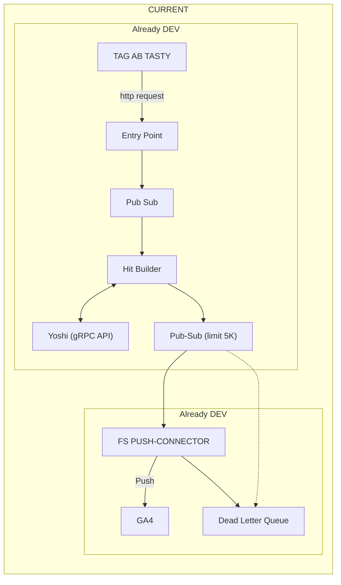

# ga4-server

```mermaid
flowchart LR
    subgraph Current["CURRENT"]
        subgraph Dev1["Already DEV"]
            A["TAG AB TASTY"] -->|http request| B["Entry Point"]
            B --> C["Pub Sub"]
            C --> D["Hit Builder"]
            D <--> E["Yoshi (gRPC API)"]
            D --> F["Pub-Sub (limit 5K)"]
        end
        subgraph Dev2["Already DEV"]
            F --> G["FS PUSH-CONNECTOR"]
            G -->|Push| H["GA4"]
            G --> I["Dead Letter Queue"]
        end
        F -.-> I
    end
```
